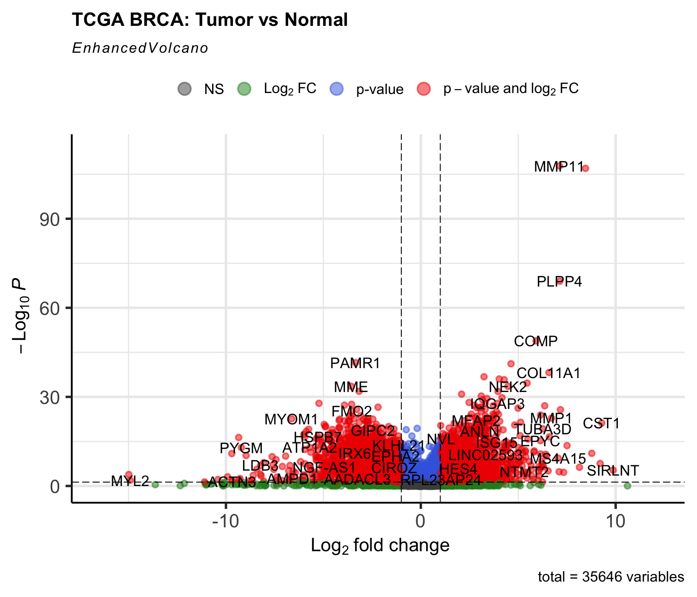
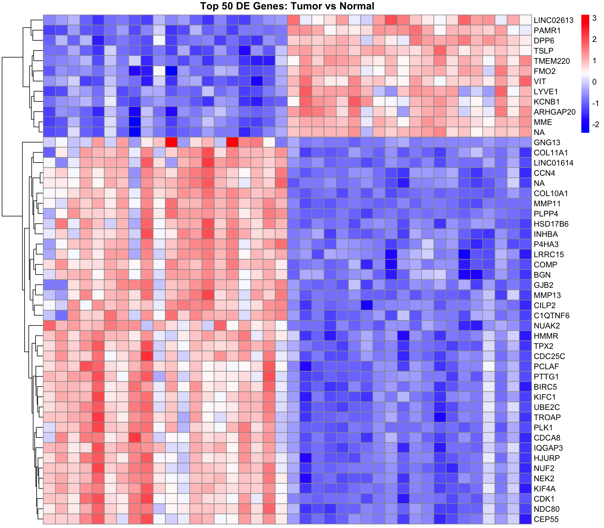
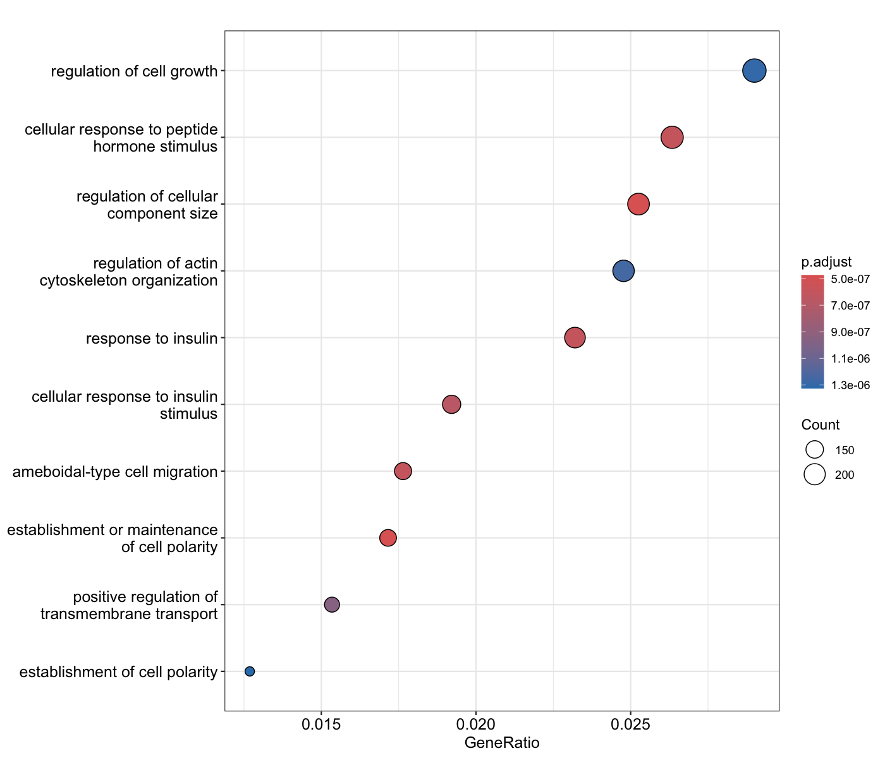

# Bulk RNA-Seq BRCA Project

## Introduction/Project Summary
I compared 20 normal vs. 20 primary tumor samples, filtered low-count genes, and ran DESeq2 with FDR correction to identify significantly differentially expressed genes (14,099 with padj < 0.05).
I validated patterns using PCA, EnhancedVolcano plots, heatmaps, limma-voom, and edgeR — all pipelines consistently highlighting tumor suppressors (PAMR1, MME, FMO2) and pro-tumorigenic genes (MMP11, PLPP4, COMP).
Gene Ontology enrichment revealed strong association with cancer-related pathways such as regulation of cellular component size and insulin response.
This project demonstrates practical skills in RNA-Seq preprocessing, DESeq2, limma/edgeR validation, annotation, visualization, and biological interpretation.

## Install and Load the Required Package

```r
#Install necessary packages
BiocManager::install(c("DESeq2", "AnnotationHub", "EnhancedVolcano", "clusterProfiler", "edgeR", "limma", "ensembldb"))
install.packages(c("dplyr", "pheatmap"))
 	
#Load necessary packages
library(recount3)
library(DESeq2)
library(dplyr)
library(AnnotationHub)
library(EnhancedVolcano)
library(pheatmap)
library(clusterProfiler)
library(edgeR)
library(limma)
library(ensembldb)
```
Next, find available projects to perform RNA-Seq on. The breast cancer dataset (BRCA) from The Cancer Genome Atlas (TCGA) was selected for this project.

```r
#Accessing and loading available human projects
human_projects <- available_projects()
#Accessing The Cancer Genome Atlas (TCGA) project IDs
tcga_projects <- subset(human_projects, project_home == "data_sources/tcga")
unique(tcga_projects$project)
```

Output
```text
[1] "ACC"  "BLCA" "BRCA" "CESC" "CHOL" "COAD" "DLBC"
 [8] "ESCA" "GBM"  "HNSC" "KICH" "KIRC" "KIRP" "LAML"
[15] "LGG"  "LIHC" "LUAD" "LUSC" "MESO" "OV"   "PAAD"
[22] "PCPG" "PRAD" "READ" "SARC" "SKCM" "STAD" "TGCT"
[29] "THCA" "THYM" "UCEC" "UCS"  "UVM"
```

```r
#I am interested in the breast cancer dataset (BRCA)
proj_info <- subset(human_projects, project == "BRCA" & project_type == "data_sources")
#Create Ranged Summarized Experiment (RES) object. Performing statistical analysis on a dataset in Summarized Experiment form makes the process much easier because it avoids the risk of dealing with formatting issues that confuses R.
rse_brca <- create_rse(proj_info)
#View top BRCA columns entries
head(colnames(colData(rse_brca)))
```
Output
```text
[1] "rail_id"                    
[2] "external_id"                
[3] "study"                      
[4] "tcga.tcga_barcode"          
[5] "tcga.gdc_file_id"           
[6] "tcga.gdc_cases.project.name"
```

I want to compare normal vs tumor groups. Rather than having to scroll through the ~1000 columns, the “grepl” function can be used to extract columns that contain “Tumor” and “Normal” in their names.

```r
#To find “Tumor” samples
names(which(sapply(colData(rse_brca), function(x) any(grepl("Tumor", x)))))
```
Output
```text
[1] "tcga.cgc_sample_sample_type"                      
[2] "tcga.gdc_cases.samples.sample_type"               
[3] "tcga.cgc_radiation_therapy_radiation_therapy_site"
[4] "tcga.xml_initial_pathologic_diagnosis_method"
```
```r
#To find “Normal” samples
names(which(sapply(colData(rse_brca), function(x) any(grepl("Normal", x)))))
```
Output 
```text
[1] "tcga.cgc_sample_sample_type"       
[2] "tcga.gdc_cases.samples.sample_type"
```
```r
#From these outputs, I am interested in “tcga.cgc_sample_sample_type” column containing both “Tumor” and “Normal” samples. 
#Use this code to identify all available groups in the column
table(rse_brca$tcga.cgc_sample_sample_type)
```
Output
```text
         Metastatic       Primary Tumor 
                  7                1127 
Solid Tissue Normal 
                112
```
```r
#Filter “Primary Tumor” and “Solid Tissue Normal” – those are the 2 groups I want to work with (this will remove “Metastasis” group
keep <- rse_brca$tcga.cgc_sample_sample_type %in% c("Primary Tumor", "Solid Tissue Normal")
rse_brca <- rse_brca[, keep]
#Set “Normal” as baseline (will need this for volcano plot)
rse_brca$tcga.cgc_sample_sample_type <- relevel(factor(rse_brca$tcga.cgc_sample_sample_type), ref = "Solid Tissue Normal")
#Subsample 20 normal and 20 tumor samples (this will save so much time and storage). I will randomly select 20 from each group using seed function set at 123.
set.seed(123)
tumor_idx <- which(rse_brca$tcga.cgc_sample_sample_type == "Primary Tumor")
normal_idx <- which(rse_brca$tcga.cgc_sample_sample_type == "Solid Tissue Normal")
#Shrink object into RAM
selected_idx <- c(sample(tumor_idx, 20), sample(normal_idx, 20))
rse_brca <- rse_brca[, selected_idx]
```

## DESeq2
The purpose of DESeq2 test is to determine the differential expression analysis of the experimental data. It measures expression levels of all the genes in a sample and provides the overall gene expression profile. It is the standard tool to measure RNA-Seq gene expression by estimating the variance of gene expression level and fitting a negative binomial distribution for each evaluated gene. This leads to more accurate and reliable p-values using Benjamini-Hochberg false discover rate (FDR) estimates and therefore reducing the risk of false positives. 
DESeq2 analysis will be performed on the BRCA experimental data in R to determine if there is statistical significance between gene abundance and sample source (p < 0.05). Because DESeq2 analysis takes a long time to run in R, it becomes necessary to filter the data (this dataset has 937 samples). Besides saving time, the benefit of this to improve analysis accuracy by removing low count genes. Here, the dataset is filtered to keep only genes with 10 or more counts in at least 20 samples.
DESeq2 analysis requires the raw counts, metadata, and design. Since DESEq2 is very sensitive to the SummarizedExperiment format. So it becomes necessary to transform the raw counts into a raw counts matrix which R can interpret. 
I will also be generating a volcano plot to visually represents the differential abundance analysis conducted via DESeq2. To ensure the volcano plot is not cluttered and is easy-to-read, a shrinking step must be performed. A log2 fold-change shrinkage is applied using apeglm via lfcShrink to get more stable fold-change estimates for genes with low counts or high variances in the plot.

```r
#Transform recount3 data into raw counts matrix (easy for DESeq2 to understand)
counts_matrix <- round(assay(rse_brca))
#Extract metadata
metadata <- as.data.frame(colData(rse_brca))
# Filter low-count genes (this code will filter the genes of 10 or more counts in 20 samples)
keep_genes <- rowSums(counts_matrix >= 10) >= 20
counts_matrix <- counts_matrix[keep_genes, ]
#Define the “dds” object – it needs the counts, the metadata, and design (sample name containing the “Primary Tumor” and “Solid Tissue Normal” genes)
dds <- DESeqDataSetFromMatrix(countData = counts_matrix, colData = metadata, design = ~ tcga.cgc_sample_sample_type)
#Run
dds <- DESeq(dds) 
#Get the results
res <- results(dds, contrast=c("tcga.cgc_sample_sample_type", "Primary Tumor", "Solid Tissue Normal"))
res
```
Output
```text
log2 fold change (MLE): tcga.cgc_sample_sample_type Primary Tumor vs Solid Tissue Normal 
Wald test p-value: tcga.cgc sample sample type Primary.Tumor vs Solid.Tissue.Normal 
DataFrame with 35646 rows and 6 columns
                   baseMean log2FoldChange     lfcSE
                  <numeric>      <numeric> <numeric>
ENSG00000223972.5  1045.875      0.0746628  0.362399
ENSG00000278267.1   480.131      0.9191875  0.489544
ENSG00000227232.5 61462.027      0.1235629  0.178097
ENSG00000243485.5   243.847     -0.2040172  0.657266
ENSG00000239945.1  3313.455      0.6734087  0.296583
...                     ...            ...       ...
ENSG00000248792.1   78.3507    -0.22207383  1.174606
ENSG00000279274.2 2273.1053    -0.00290592  0.236075
ENSG00000229238.3  101.3477    -0.67399487  1.023715
ENSG00000231514.1  466.0908     0.28931021  0.412248
ENSG00000237917.1  314.1835     0.25958197  1.316866
                        stat    pvalue      padj
                   <numeric> <numeric> <numeric>
ENSG00000223972.5   0.206024 0.8367722 0.8932732
ENSG00000278267.1   1.877641 0.0604303 0.1235179
ENSG00000227232.5   0.693796 0.4878102 0.6198306
ENSG00000243485.5  -0.310403 0.7562546 0.8372913
ENSG00000239945.1   2.270557 0.0231738 0.0561498
...                      ...       ...       ...
ENSG00000248792.1 -0.1890624  0.850044  0.902400
ENSG00000279274.2 -0.0123093  0.990179  0.993973
ENSG00000229238.3 -0.6583812  0.510293  0.640362
ENSG00000231514.1  0.7017871  0.482812  0.615202
ENSG00000237917.1  0.1971211  0.843733  0.898079
```
```r
#LFC shrinkage for generating volcano plot (log transform function generates scale to reduce the clutter of low-count genes and prevents technical noise from appearing as large biological effects in volcano plot)
resultsNames(dds)
```
Output
```text
[1] "Intercept"                                                       
[2] "tcga.cgc_sample_sample_type_Primary.Tumor_vs_Solid.Tissue.Normal"
```
```r
#assign result name
res_shrunk <- lfcShrink(dds, coef = "tcga.cgc_sample_sample_type_Primary.Tumor_vs_Solid.Tissue.Normal", type = "apeglm")
```

Here, the “res” dataframe contains 35646 rows which corresponds to a total of 35646 genes from the 20 normal and 20 tumor samples. Because it is unrealistic to sift through the adjusted p-values (padj) of 35646 genes, the following code can be ran to identify how many genes have a padj < 0.05 (statistical significance between gene abundance and sample)

```r
# Count how many genes have an adjusted p-value less than 0.05
sum(res$padj < 0.05, na.rm = TRUE)
```
Output
```text
[1] 14099
```

14099 genes have a padj <0.05. For these genes, I reject the null hypothesis of no differential expression between “Primary Tumor” and “Solid Tissue Normal” sample groups.
Note: some printed tables may show a subset of genes with padj > 0.05; however, 14099 overall genes with padj < 0.05 and thus reject the null hypothesis for those genes.
Notice gene ENSG00000239945.1 – its p-value is 0.0231738 while it’s adjusted p-value is 0.0561498 after the BH correction. Performing this correction has controlled the expected FDR and reduced false positives (in this case a statistically significant gene).

## AnnotationHub Gene Mapping
DESeq2 differential abundance analysis provides the gene IDs in Ensembl form, which can be confusing to follow. By gene mapping via the AnnotationHub package, it is possible to change the Ensembl form naming into an easier name to interpret. Be sure to do this step before the volcano plot, otherwise the gene names on the plot will be in Ensembl form and will be harder to follow.

```r
#Remove “.#” so that AnnotationHub recognizes them (ex: ENSG00000229129.1 -> ENSG00000229129)
rownames(res) <- gsub("\\..*", "", rownames(res))
rownames(res_shrunk) <- gsub("\\..*", "", rownames(res_shrunk))
#Access the hub
ah <- AnnotationHub()
#Obtain queries from Human organism database (OrgDb)
org_db <- query(ah, c("OrgDb", "Homo sapiens"))[[1]]
#Maping Ensembl IDs to Gene Symbols
res$symbol <- mapIds(org_db, keys = rownames(res), column = "SYMBOL", keytype = "ENSEMBL", multiVals = "first")
res_shrunk$symbol <- mapIds(org_db, keys = rownames(res_shrunk), column = "SYMBOL", keytype = "ENSEMBL", multiVals = "first")
```

## Plotting PCA Data
Principal component analysis (PCA) is a method that transforms high-dimensional data by reducing the number of variables while keeping significant information.
Check if they are present via a PCA plot.

```r
#Transform data for visualization
vsd <- vst(dds, blind = FALSE)
#Plot PCA (check if tumor and normal form separate clusters)
plotPCA(vsd, intgroup = "tcga.cgc_sample_sample_type")
```


Interpretation: This plot displays two distinct clusters – one for the “Primary Tumor” samples and one for the “Solid Tissue Normal” group, confirming that each group’s gene expression profiles vary significantly from one another. The “Primary Tumor” points cluster close with one another, while the “Solid Tissue Normal” are more dispersed. This suggests the former’s genes expression profiles are homogenous in while the latter’s genes heterogenous. PC1 and PC2 represent variables designed to capture the maximum amount of gene expression variance in the dataset. PC1 captures 38% of the biological differences in gene expression between both samples, PC2 represents a secondary source of variation (example: tumor stage, patient age, or batch effects)
A batch effect refers to the variation in data caused by a non-biological variable outside of the study (ex: different testing centers, different testing methods, tissue source, testing on different days of the week, etc…). They raise issues in data interpretation as they can lead to incorrect data interpretation (ex: false positives or negatives).

## Enhanced Volcano
A volcano plot provides a comparative visual between both tumor and normal groups and illustrating the significant genes corresponding to each group. I expect to observe significance in pro-tumorigenic genes/oncogenes/and growth factors in the tumor group and regulatory/tumor suppressor genes in the normal group.

```r
#Transform data for visualization
#Plot and use clear cutoffs (p-value 0.05, fold change 1.0)
EnhancedVolcano(res_shrunk, lab = res_shrunk$symbol, x = "log2FoldChange", y = "padj", title = "TCGA BRCA: Tumor vs Normal", pCutoff = 0.05, FCcutoff = 1.0)
```



Interpretation: In the volcano plot, the y-axis represents the p-value log, where the larger the log-value is, the smaller the p-value of that gene is and more statistically significant it is. On the other hand, the x-axis represents the fold change log. The fold change is the ratio of expression of genes in the tumor samples/expression of genes in the normal samples (since I set the “Normal Solid Tissue” group as the baseline earlier, it is in the denominator). A negative fold change indicates the gene is more commonly expressed in the normal samples, while a positive fold change indicates the gene is more commonly expressed in the tumor samples.
The plot illustrates PAMR1, MME, and FMO2, which do have statistical significance (padj < 0.05) and are more abundant in the “Normal Solid Tissue” group. On the other hand, genes such as MMP11, PLPP4, COMP, COL11A1, and NEK2 are more commonly expressed in the “Primary Tumor” group. These genes appear higher up along the y-axis, therefore indicating they have very low p-values < 0.05 and illustrate statistical significance between gene abundance and sample.

## Generate a Heatmap
I want to see the top 50 genes expressed in both the normal and tumor groups. The following code can be used to confirm the findings to that of the volcano plot, but in a more structured graph.

```r
#Filter 50 genes by adjusted p-value/remove NA padj values
ord <- order(res$padj, na.last = NA)
top50_genes <- head(ord, 50)
mat <- assay(vsd)[top50_genes, ]
# Perform Z-score scaling (Standardize rows)
mat <- t(scale(t(mat)))
#Map Ensembl IDs to symbols (this will show the gene names as opposed to the confusing Ensembl IDs)
rownames(mat) <- res$symbol[top50_genes]
# Plot with pheatmap
pheatmap(mat, cluster_rows = TRUE, cluster_cols = FALSE, show_rownames = TRUE, show_colnames = FALSE, main = "Top 50 DE Genes: Tumor vs Normal", color = colorRampPalette(c("blue", "white", "red"))(50))
```



Here, the “Primary Tumor” group on the first half of the map and the “Human Solid Tissue” group on the second half of the map. There are very clear distinctions between both groups – genes that are heavily abundant in the normal group have low abundances in the tumor groups (i.e. TSLP, PAMR1, FMO2, VIT, and MME), and vice versa (NUAK2, NEK2, MMP11, PLPP4, COMP, COLL11A1, and KIF4A). Some genes do show a degree of lower expression between 2 groups (i.e. blue grids are seen in the same row between both sample groups). However the overall map pattern illustrates a distinct gene abundances profile between both groups, which confirms the DESeq2 and volcano plot results. Finally, a horizontal dendogram was added to illustrate hierarchical clustering of genes. This illustrates that clustered genes represent similar abundance patterns amongst each other (ex: TPX2 and CDC25C).

## Gene Set Enrichment 
Gene enrichment is a computational method used to identify significant genes in large gene expression lists, which are associated with various phenotypes or physiological pathways. Here I want to identify the phenotype/pathway the significant genes are associated with.

```r
#Filter for significant genes (padj < 0.05)
sig_genes <- rownames(res)[which(res$padj < 0.05)]
#Run GO enrichment function on the significant gene sets
go_results <- enrichGO(gene = sig_genes, OrgDb = org_db, ont = "BP", keyType = "ENSEMBL")
dotplot(go_results)
```



Interpretation: In this Gene Ontology (GO) dot plot, the x-axis represents the GeneRatio, which represents the proportion of genes associated with each biological process, and the y-axis represents the enriched phenotype/biological process. The point size corresponds to the number of enriched genes (Count) and color represents p-value (p.adjust), where terracotta dots represent higher significance and blue dots represent lower significance. Here, the most significant genes in processes such as regulation of cellular component size and response to insulin both phenotypes being strongly associated with strong cancer biology. Conversely the genes with lower significance are associated with regulation of cell growth and regulation of actin cytoskeleton organization. Low significance for cell growth regulation confirms the cancer phenotype as this process is downregulated in tumors.

## Limma Voom/edgeR differential abundance analysis
Limma voom is another method to test for differential abundance expression. Unlike DESeq2 which relies on a negative-binomial count model, limma with voom converts counts to log CPM with precision weights (voom), then uses linear models + empirical Bayes moderated t tests on those weighted log values. On the other hand, edgeR relies on negative‑binomial GLMs with empirical Bayes dispersion estimation. Because limma was originally generated for microarray analysis, it commonly uses edgeR’s normalization.
Here, I want to compare the results of both methods and will perform a limma voom analysis, perform gene mapping on the genes, and find the top 10 significant genes.

```r
#Prepare the data
dge <- DGEList(counts = counts(dds))
dge <- calcNormFactors(dge)
design <- model.matrix(~ tcga.cgc_sample_sample_type, data = colData(dds))
#Limma voom pipeline
v <- voom(dge, design)
fit <- lmFit(v, design)
fit <- eBayes(fit)
limma_res <- topTable(fit, coef = 2, number = Inf)
#edgeR QL pipeline
dge_edgeR <- estimateDisp(dge, design)
fit_edgeR <- glmQLFit(dge_edgeR, design)
qlf <- glmQLFTest(fit_edgeR, coef = 2)
edgeR_results <- topTags(qlf, n = Inf)$table
#Perform AnnotationHub Gene Annotation to obtain gene name from Ensembl ID.
rownames(limma_res) <- gsub("\\..*", "", rownames(limma_res))
rownames(edgeR_results) <- gsub("\\..*", "", rownames(edgeR_results))
ah <- AnnotationHub()
org_db <- query(ah, c("OrgDb", "Homo sapiens"))[[1]]
#Maping Ensembl IDs to Gene Symbols
limma_res$symbol <- mapIds(org_db, keys = rownames(limma_res), column = "SYMBOL", keytype = "ENSEMBL", multiVals = "first")
edgeR_results$symbol <- mapIds(org_db, keys = rownames(edgeR_results), column = "SYMBOL", keytype = "ENSEMBL", multiVals = "first")
#View top 10 limma (uses “adj.P.Val”)
limma_final <- limma_res[order(limma_res$adj.P.Val), ]
as.data.frame(limma_final[1:10, c("symbol", "adj.P.Val")])
```

Output
```text
                 symbol    adj.P.Val
ENSG00000099953   MMP11 5.113150e-14
ENSG00000149090   PAMR1 4.066166e-13
ENSG00000196549     MME 4.066166e-13
ENSG00000145777    TSLP 4.968694e-13
ENSG00000105664    COMP 7.305642e-13
ENSG00000187824 TMEM220 5.147805e-12
ENSG00000123500 COL10A1 6.423397e-12
ENSG00000136158   SPRY2 7.141490e-12
ENSG00000240666    <NA> 1.480178e-11
ENSG00000090889   KIF4A 1.480178e-11
```
```r
#View edgeR top 10 (uses “FDR”)
edgeR_final <- edgeR_results[order(edgeR_results$FDR), ]
as.data.frame(edgeR_final[1:10, c("symbol", "FDR")])
```
Output
```text
                   symbol          FDR
ENSG00000099953     MMP11 1.348209e-16
ENSG00000123500   COL10A1 1.851543e-15
ENSG00000203805     PLPP4 1.020292e-14
ENSG00000149090     PAMR1 3.928565e-13
ENSG00000226806   LCT-AS1 4.345847e-13
ENSG00000025423   HSD17B6 6.189490e-12
ENSG00000105664      COMP 6.189490e-12
ENSG00000177234 LINC01561 6.189490e-12
ENSG00000160161     CILP2 7.882701e-12
ENSG00000196549       MME 1.281916e-11
```

In the limma voom and edgeR analyses, there are very significant genes - MMP11, COL10A1, PLPP4, COMP, PAMR1, and MME, all of which overlap with the most significant genes observed in the DESeq2 analysis and EnhancedVolcano. Therefore, the differential abundances analysis between DESeq2, limma voom and edgeR pipelines are very similar and these are all useful methods which can be used in RNA-Seq workflows.

## BONUS! Using GRanges to find the chromosome #, start and stop position, and strand direction of a gene of interest
If you really want to take your gene analysis a step further, you can utilize the GRanges tool to identify the chromosome your gene of interest is located. I am interested in MMP11, a key pro-tumorigenic protease which plays a role in the progression of breast, pancreatic, and gastric cancers. In the 3 differential abundance pipelines, it was the most significant gene.

```r
#use ah <- AnnotationHub()
#Pull the list of all Ensembl databases for humans
human_ens_dbs <- query(ah, c("EnsDb", "Homo sapiens"))
#Print the AH IDs and Ensembl version (obtain the latest)
as.data.frame(mcols(human_ens_dbs))[, c("title", "rdatadateadded")]
```

Output
```text
                                      title rdatadateadded
AH53211   Ensembl 87 EnsDb for Homo Sapiens     2017-02-07
AH53715   Ensembl 88 EnsDb for Homo Sapiens     2017-04-05
AH56681   Ensembl 89 EnsDb for Homo Sapiens     2017-06-29
AH57757   Ensembl 90 EnsDb for Homo Sapiens     2017-08-31
AH60773   Ensembl 91 EnsDb for Homo Sapiens     2017-12-21
AH60977   Ensembl 92 EnsDb for Homo Sapiens     2018-04-13
AH64446   Ensembl 93 EnsDb for Homo Sapiens     2018-08-20
AH64923   Ensembl 94 EnsDb for Homo sapiens     2018-10-11
AH67950   Ensembl 95 EnsDb for Homo sapiens     2019-01-14
AH69187   Ensembl 96 EnsDb for Homo sapiens     2019-04-15
AH73881   Ensembl 97 EnsDb for Homo sapiens     2019-05-02
AH73986   Ensembl 79 EnsDb for Homo sapiens     2019-05-02
AH75011   Ensembl 98 EnsDb for Homo sapiens     2019-05-02
AH78783   Ensembl 99 EnsDb for Homo sapiens     2019-10-29
AH79689  Ensembl 100 EnsDb for Homo sapiens     2020-04-27
AH83216  Ensembl 101 EnsDb for Homo sapiens     2020-04-27
AH89180  Ensembl 102 EnsDb for Homo sapiens     2020-10-27
AH89426  Ensembl 103 EnsDb for Homo sapiens     2020-10-27
AH95744  Ensembl 104 EnsDb for Homo sapiens     2021-05-18
AH98047  Ensembl 105 EnsDb for Homo sapiens     2021-10-20
AH100643 Ensembl 106 EnsDb for Homo sapiens     2022-04-21
AH104864 Ensembl 107 EnsDb for Homo sapiens     2022-04-25
AH109336 Ensembl 108 EnsDb for Homo sapiens     2022-10-31
AH109606 Ensembl 109 EnsDb for Homo sapiens     2022-10-30
AH113665 Ensembl 110 EnsDb for Homo sapiens     2023-04-25
AH116291 Ensembl 111 EnsDb for Homo sapiens     2023-10-23
AH116860 Ensembl 112 EnsDb for Homo sapiens     2024-04-30
AH119325 Ensembl 113 EnsDb for Homo sapiens     2024-10-28
```
```r
#Pull latest Ensembl 113 for 2025 (Ensembl AH119325 added 2024-10-28)
edb <- ah[["AH119325"]] 
#Find location for MMP11 
mmp11_gr <- genes(edb, filter = ~ symbol == "MMP11")
#Print results table
as.data.frame(mmp11_gr)[, c("symbol", "seqnames", "start", "end", "strand")]
```
Output
```text
                symbol       seqnames    start      end strand
ENSG00000099953  MMP11             22 23768226 23784316      +
ENSG00000275365  MMP11 HSCHR22_1_CTG7     4588    20678      +
```

MMP11 is found on chromosome 22 on the positive (+) strand direction between positions 23768226-23784316.

## Conclusion
In this project, while using a small subset of 20 normal and 20 tumor samples, there is a clear significance between gene abundance between both groups via DESeq2 differential abundance analysis. It is noted that tumor suppressor genes, such as PAMR1, MME, and FMO2, are more abundant in the normal group. On the other hand, pro-tumorigenic proteases/oncogenes/growth factors, such as MMP11, PLPP4, and COMP, are more abundant in the tumor group. Additionally, significant genes to be involved in key biological pro-tumorigenic processes were observed, such as regulation of cellular component size, response to insulin, as well as low significance for regulation of cell growth. This can be useful analysis tools to apply in a clinical or biological lab setting to analyze genotype-phenotype relationships within healthy and sick patients. Finally, limma voom and edgeR differential abundance analyses produced similar top genes and supports the DESeq2 findings.". To further advance this project, it is possible to take potential batch effects, such as sequencing centers, into account in the DESeq2 analysis. To consider centers as a potential batch effect, the DESeq2 analysis would be performed as follows:

```r
#Find batch effect list (examples include plate, testing center, sequencing data, tissue source site, and biospecimen core resource)
metadata_names <- colnames(colData(rse_brca))
metadata_names[grep("batch|plate|center|date|tss|bcr", metadata_names, ignore.case = TRUE)]
#Run DESeq2 analysis with centers "tcga.gdc_center.center_id" into design.
dds <- DESeqDataSetFromMatrix(countData = counts_matrix, colData = metadata, design = ~ tcga.gdc_center.center_id + tcga.cgc_sample_sample_type)
```

## Final Note
Analysis was performed using the Bioconductor ecosystem (recount3, DESeq2, edgeR, limma). AI tools were utilized to optimize code syntax and visualization parameters, while ecological interpretations and statistical validations were manually conducted to ensure biological accuracy.


